# 通用 FEM 后处理与模型修正平台 —— 技术交付文档（图文版）

**文档版本：** 1.0
**编写日期：** 2026-07-06
**文档性质：** 项目交付 · 技术架构与关键技术说明
**适用读者：** 项目评审、甲方技术负责人（主）；接手开发者（次）

---

## 阅读指引

本文是一份**图文并茂的交付说明**，主线是一句话：

> **把不同求解器产出的模型文件（Abaqus / Nastran），从上传、解析、预处理，一路送到浏览器里做三维云图交互，并在此之上用试验数据反过来修正仿真模型。**

- 面向评审读者：读**第 1～3 章**即可掌握"系统做什么、难在哪、怎么解决、达成了什么效果"。
- 面向接手开发者：**第 4～6 章**给出程序组织结构、接口、关键代码位置。
- 本文与仓库内已有文档的关系：
  - `docs/技术文档.md`（v2.0）是**逐模块的详尽工程说明书**（背景/数据对象/模块设计/能力指标/部署），本文不重复其内容，而是把它**串成一条端到端主线并配图**，并补上它未展开的"技术难点故事"。需要精确接口/部署细节时以它和 `docs/l3/L3-API-Quick-Reference.md` 为准。
  - `ODB-Service-Architecture.md`（v5）是**最初的整体设计文档**，理解"当初为什么这么设计"时参考；凡与现状冲突处（详见第 3 章的几处"设计演进"），以本文和代码为准。

> **关于图**：本文所有流程图用 [Mermaid](https://mermaid.js.org/) 描述，GitHub、VS Code、Typora 等可直接渲染。另附一份**本地 HTML 版**（`FEM平台技术交付-图文版.html`），内嵌 SVG 图，双击即可在浏览器打开，适合演示。

---

## 目录

1. [平台全景：一个平台，两条主线](#一平台全景一个平台两条主线)
2. [主线一 · 端到端可视化管线（上传 → 解析 → 预处理 → 服务 → 渲染）](#二主线一--端到端可视化管线上传--解析--预处理--服务--渲染)
3. [核心技术难点专题](#三核心技术难点专题)
4. [主线二 · 模型修正闭环（试验 → 匹配 → 灵敏度 → 贝叶斯 → 写回）](#四主线二--模型修正闭环试验--匹配--灵敏度--贝叶斯--写回)
5. [程序组织结构](#五程序组织结构)
6. [最终达成的效果](#六最终达成的效果)
7. [附录 · 文档地图](#七附录--文档地图)

---

## 一、平台全景：一个平台，两条主线

### 1.1 要解决的工程问题

传统 FEM 后处理工具（Abaqus CAE、HyperView、Femap 等）有三道墙，挡住了工程评审的效率：

| 痛点 | 具体表现 |
|---|---|
| **许可证墙** | 后处理软件按席位收费，团队里只有少数人有 license，设计师/项目经理/甲方看不了结果 |
| **格式墙** | Abaqus（INP/ODB）和 Nastran（BDF/OP2）互不兼容，多工况、多求解器对比要反复手工转换 |
| **规模墙** | 桌面客户端全量加载，千万节点模型内存爆、单帧云图要等几十秒，撑不起评审现场的实时交互 |

本平台的目标：**把仿真结果发布成一个网页服务，任何浏览器打开就能看三维云图，免 license、跨求解器、扛千万节点**；并在此基础上，**用物理试验数据自动校准仿真模型参数**。

### 1.2 两条主线，共用一个进程

平台是**一个 FastAPI 进程**（`app.py`），内部跑两条并行主线：

```mermaid
flowchart TB
    subgraph 输入[多格式模型文件]
        INP[Abaqus INP<br/>几何]
        ODB[Abaqus ODB<br/>几何+结果]
        BDF[Nastran BDF<br/>几何]
        OP2[Nastran OP2<br/>结果]
        UNV[试验 UNV<br/>模态/静力]
    end

    subgraph 平台[FastAPI 单进程 app.py]
        direction TB
        M1["<b>主线一 · ODB 可视化服务</b><br/>L1 提取 → L2 预处理 → L3 服务<br/>把大规模 FEM 数据推给浏览器渲染"]
        M2["<b>主线二 · 模型修正服务</b><br/>试验-仿真对比 → 灵敏度 → 贝叶斯迭代<br/>反过来校准仿真模型参数"]
        M1 -. 唯一耦合点：把"修正量"<br/>写回 L3 当成一个结果场 .-> M2
    end

    subgraph 出口[出口]
        WEB[浏览器 Three.js<br/>三维云图交互]
        DB[(MySQL<br/>修正结果追溯)]
    end

    INP & ODB & BDF & OP2 --> M1 --> WEB
    BDF & UNV --> M2 --> DB
    M2 -. 修正效果云图 .-> WEB
```

- **主线一**（本文第 2、3 章）：读 Abaqus ODB / INP、Nastran BDF / OP2，通过三层流水线把最多 ~1000 万节点、数十帧的 FEM 数据推给 Three.js 前端做 3D 云图。
- **主线二**（本文第 4 章）：基于试验数据（UNV 模态、BDF 静力）与仿真结果的对比，算灵敏度矩阵，用贝叶斯迭代修正材料属性、壳厚等参数，结果写回 MySQL。
- **两条主线唯一的耦合点**：主线二算出的"每个部件被改了多少"，会作为一个新的结果场写回主线一，于是评审可以像看应力云图一样，**在浏览器里直接看到这次修正动了模型的哪些地方**。

---

## 二、主线一 · 端到端可视化管线（上传 → 解析 → 预处理 → 服务 → 渲染）

这一章是本文的骨架。整条链路是一个**单向、分层、无反向依赖**的流水线，数据像流水一样从左到右，每过一层就换一次"形态"：

```mermaid
flowchart LR
    A[".odb / .inp<br/>.bdf / .op2<br/>(求解器专有格式)"]
    B[".npy 临时文件<br/>(L1 内部中转)"]
    C["l1/*.h5 + manifest.db<br/>(忠实转储 HDF5)"]
    D["l2/*.h5<br/>(渲染缓冲+八叉树)"]
    E["内存 ModelIndex<br/>(pre-fork 加载)"]
    F["L3BE 二进制信封<br/>(HTTP 响应)"]
    G["前端 TypedArray<br/>→ GPU 缓冲"]

    A -->|"① 解析<br/>(ODB 需 license)"| B
    B -->|"② 打包 (Python3)"| C
    C -->|"③ 预处理 (纯 numpy)"| D
    D -->|"④ 启动时装载"| E
    E -->|"⑤ 按请求切片打包"| F
    F -->|"⑥ HTTP + GZip"| G
    G -->|"⑦ WebGL 渲染"| H["🖥️ 浏览器三维云图"]
```

分层看，就是经典的三层流水线 + 前端：

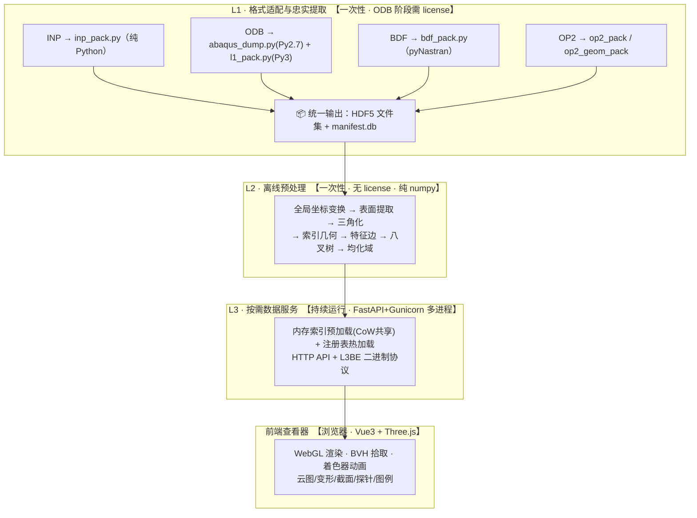

下面把这条链路拆成**四个环节**，每个环节都从五个维度讲清楚：**① 技术难点 · ② 技术思路 · ③ 实现路径 · ④ 程序组织结构 · ⑤ 最终效果**。

---

### 2.1 环节一：多格式上传与忠实提取（L1）

#### ① 技术难点

Abaqus 和 Nastran 是两套完全不同的"方言"：单元命名不同（Abaqus 按形状/材料命名 `C3D8R`，Nastran 按连接关系命名 `CHEXA`）、坐标系约定不同、结果组织不同（Abaqus 是 Step/Frame/Field 三层树，Nastran 是 SOL/Subcase/Result 三层树）。更棘手的是 **ODB 是 Abaqus 私有二进制格式，唯一的读取方式是 Abaqus 自带的受限 Python 2.7 环境，而这个环境装不了 h5py**，还得占用稀缺的 license。

#### ② 技术思路

**"在最上游就把格式差异焊死"**：不管进来的是哪种格式，L1 一律把它翻译成**同一套内部表示**——HDF5 几何/结果文件 + 一个叫 `manifest.db` 的 SQLite 路由索引。这样 L2、L3、前端**完全不需要知道数据从哪来**，新增一种格式只要加一个 L1 适配器，其他层零改动。

针对 ODB 的 license 问题，采用**两阶段拆分**：能读 ODB 但受限的环境只干"读"，能写 HDF5 的标准环境干"写"，中间用 `.npy` 临时文件交接。

#### ③ 实现路径

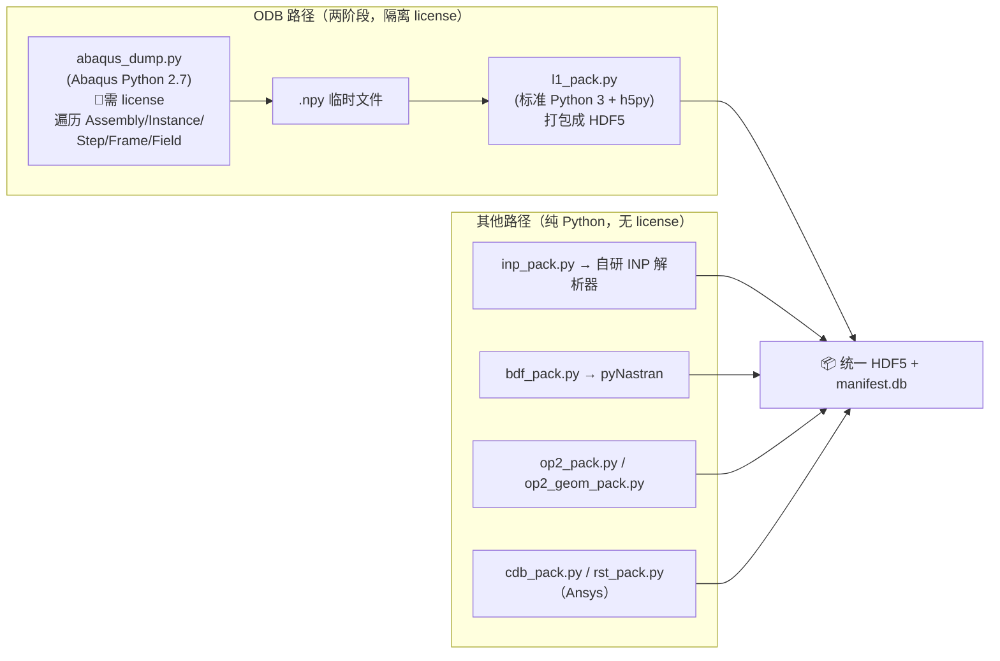

- **两阶段的额外好处**：如果打包（Phase 2）出 bug，不用重新烧一次昂贵的 license 跑 Abaqus，直接拿已有的 `.npy` 重跑 `l1_pack.py` 即可。
- **忠实原则**：L1 只搬运、不加工——不做坐标变换、不三角化、不裁数值，保留 ODB 的全部原始精度，把"加工"留给下一层。
- **多帧布局**：结果统一存成 `[帧数, 节点数, 分量数]` 的三维张量，这样"取某一帧全模型"和"取某个节点全时程"都能一次磁盘读取完成。

#### ④ 程序组织结构

```
src/l1/
├── abaqus_dump.py       — ODB Phase 1（Abaqus Python 2.7）
├── l1_pack.py           — ODB Phase 2（打包 HDF5）
├── inp_pack.py          — Abaqus INP 适配器
├── bdf_pack.py          — Nastran BDF 适配器
├── op2_pack.py          — Nastran OP2 纯结果
├── op2_geom_pack.py     — Nastran OP2 含嵌入几何
├── cdb_pack.py / rst_pack.py — Ansys 适配器
└── manifest_schema.py   — manifest.db 表结构与实例名归一化 canon_instance()
```

`manifest.db` 是整条流水线的"路由中枢"，L3 运行时**从不扫描文件系统**，任何"这个字段在哪个文件的哪个路径"都是一次 SQLite 查询：

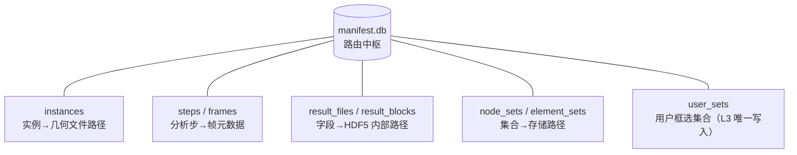

#### ⑤ 最终效果

- **四种格式、四种工作流**统一接入：ODB 单文件、INP+ODB、BDF+OP2、OP2 单文件（自动探测 GEOM1/GEOM2 表判断是否含嵌入几何）。
- **几何与结果解耦**：可以先传 INP/BDF 出几何轮廓，再多次追加不同工况的 ODB/OP2 结果组做多工况对比。
- **license 严格隔离在提取阶段**：INP/BDF/OP2 全链路免 license，ODB 也只有提取那一下需要。

---

### 2.2 环节二：预处理与渲染缓冲预构建（L2）

#### ① 技术难点

L1 存下来的是**完整体网格**（含大量看不见的内部面），但：
- GPU 只认三角面，实体单元的六面体/四面体面得先"抠表面 + 三角化"；
- 千万单元模型如果用 Python 逐单元逐面判断内外，要跑几个小时；
- 高阶单元（带中间节点）怎么处理，直接影响云图精度（详见第 3 章）；
- 模型看起来要有"棱角"，得算出**特征边**（轮廓线 + 折角棱线），否则渲染出来是一坨没有边界的糊状物。

#### ② 技术思路

**把所有计算密集的活儿一次性搬到离线阶段**，用 NumPy 全程向量化（不写 Python 循环），算好的"渲染就绪缓冲"存成 HDF5，L3 服务期间只读不算。核心是一句话：**"计算"和"服务"彻底分家**。

#### ③ 实现路径

表面提取的精妙之处在于一个**纯向量化的哈希去重技巧**：

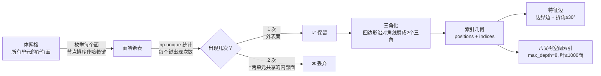

- **索引几何（一处重要的设计演进，详见 3.2）**：最初设计是 "Triangle Soup"（每个三角形三个顶点完全独立、不共享），实测内存太大，改成**在同一单元面内共享顶点**的索引几何（`positions[Nv,3]` + `indices[Nt,3]`），内存降到原来的 1/3~1/2，同时保留了跨单元面的"硬边"效果。
- **均化域（架构文档没提、代码新增的子系统）**：用**并查集**把"同一截面、法向夹角在阈值内"的壳单元分成一组，只有同组内才做法向平滑，实体和壳即使相邻也不互相平滑——这决定了平滑着色"平滑得对不对"。

#### ④ 程序组织结构

```
src/l2/
└── ingest.py    — 一个文件跑完整条 L2（约 1600 行）
                   compute_global_coords / collect_faces / triangulate
                   / build_render_faces（高阶细分）/ compute_feature_edges
                   / build_domain_ids（均化域）/ build_octree
```
输出：`l2/geometry/<inst>_surface.h5`（几何+特征边+特殊单元）、`l2/render/<inst>_render.h5`（渲染缓冲+八叉树+均化域），并回填 `manifest.db`。

#### ⑤ 最终效果

- 百万级单元模型 L2 预处理**分钟级**完成（实测 100 万 C3D8R 约 3 分钟，含八叉树）。
- 输出的索引几何，永驻前端 GPU 后**云图切换只需重传颜色、不重传几何**。
- 特殊单元（梁/杆线、质量点、耦合"蜘蛛线"）一并提取，不再"看不见"（详见 3.5）。

---

### 2.3 环节三：按需数据服务（L3）

#### ① 技术难点

L3 是持续运行的在线服务，生产环境要开多个 Gunicorn worker 吃满多核。难点有三：
- 单个 ODB 的内存索引约 2 GB，**4 个 worker 各存一份就是 8 GB**，扛不住；
- 大规模数值数组（顶点坐标、颜色、标量场）用 JSON 传，体积膨胀 33%、序列化开销大、局域网都要等几秒；
- HDF5 / SQLite 都是**单写多读**，负责"算"的后台进程和负责"读"的 web 进程必须并行还不能打架。

#### ② 技术思路

- **内存靠 fork + 写时复制（Copy-on-Write）共享**：主进程先把索引装好，再 fork 出 worker，操作系统让所有 worker 共享同一份只读物理内存。
- **传输靠自研二进制协议 L3BE** 替代 JSON。
- **并发靠"读写分离 + 状态机"**：web 进程只读，写文件的活儿全交给独立的后台 `job_runner`，两者靠轮询 `manifest.db` 的状态字段同步，不用复杂 IPC。

#### ③ 实现路径

内存共享模型是 L3 最核心的设计：

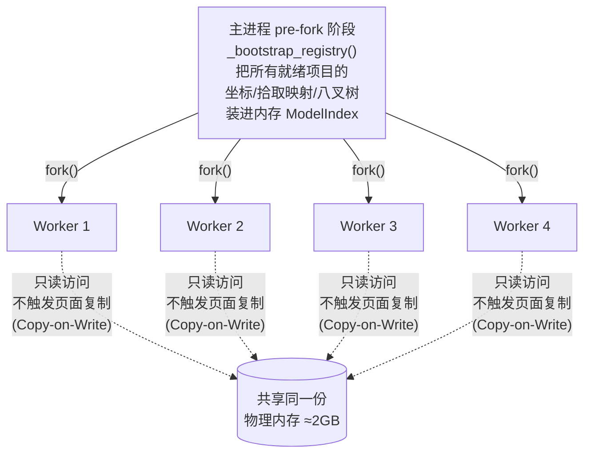

- **label→行号 映射用 numpy 排序数组 + searchsorted，不用 dict**：dict 每个键值对有对象头开销、且在多进程下容易触发内存页私有化让 CoW 失效；排序数组是连续内存块，能被多 worker 真正共享，还能一次批量二分查找几千个节点。
- **L3BE 二进制信封**：固定头部 + 段表 + 多段裸数组，服务端 `ndarray.tobytes()` 零拷贝，前端按偏移解析成 TypedArray，一个响应能同时装几何、索引、颜色、图例多段异构数组，配 GZip 自动压缩。
- **job_runner 独立进程**：轮询大循环，认领待处理的 project / result_group / L2 任务，调对应的 pack/ingest 子进程；抢占任务靠一条原子 SQL（`UPDATE ... WHERE ...=(SELECT ... LIMIT 1)` 判 `changes()==1`），SQLite WAL 模式天然支持多进程竞争。

#### ④ 程序组织结构

L3 内部严格三层（Router 只解析 HTTP、Service 干业务、Repo 碰数据库）：

```
src/l3/
├── api/routes/     — 15 个路由文件（health/projects/geometry/results/query/...）
│                     近 70 个端点，只做协议解析+校验
├── services/       — 业务核心（12 文件，>1 万行）
│                     query_service(拾取/bbox) · result_service(云图/变形)
│                     · color_service(着色/图例)
├── infra/          — 数据访问：manifest_repo / registry_repo / hdf5_repo
│                     · l3be.py(二进制协议) · runner_thread.py(内嵌 runner)
└── core/           — config(配置) · state(ModelIndex 内存索引) · errors
```

项目在系统内的状态机：

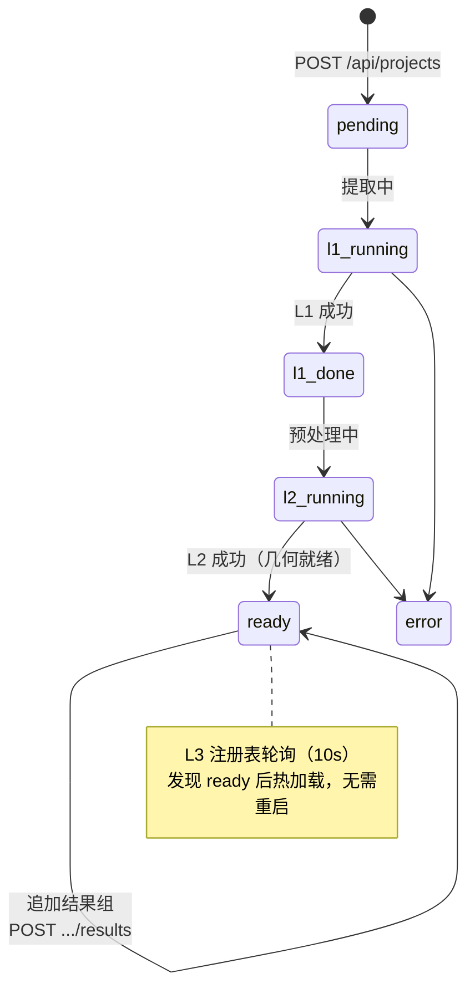

#### ⑤ 最终效果

- **4 个 worker 并发服务单项目，内存开销与单 worker 相当（≈2 GB）**。
- 千万顶点级数据从服务端到前端展示的端到端延迟（局域网）在 **2 秒内**。
- 新项目就绪后 **10 秒内**被热加载，服务不重启。

---

### 2.4 环节四：浏览器 GPU 可视化（前端）

#### ① 技术难点

要在浏览器（而非专业客户端）里，对千万三角面模型做到：拾取点选毫秒级响应、模态振型 60fps 流畅动画、云图/变形/截面实时交互——而浏览器的 CPU 是很弱的。

#### ② 技术思路

**能交给 GPU 的绝不让 CPU 算**：几何数据一次上传永驻 GPU 显存；云图切换只更新颜色属性、不重传几何；模态动画在顶点着色器里算；拾取用 BVH 空间树把 O(N) 降到 O(log N)。

#### ③ 实现路径

模态振型动画是"GPU 优先"思路的典型：谐波振动 `d(t) = Re·cos(ωt) + Im·sin(ωt)` 是天然可并行的逐顶点计算，直接写进顶点着色器——

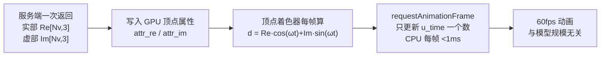

- **拾取用 BVH**：`three-mesh-bvh` 在加载时一次性建层级包围体树，此后每次点选 O(log N)；点中三角面后，服务端用内存里的 `render_source_elem_row` 数组 O(1) 反查出 ODB 单元标签，再从 L1 HDF5 读该单元该帧的**精确原始值**（不是插值近似）。
- **变形显示**：把"改缩放系数 → 重新请求坐标"改成"后端只发一次原始位移量，缩放全在 GPU shader uniform 里做"，滑块拖动零网络开销；对几何非线性分析（`nlgeom=True`）自动锁定比例因子=1，防止误读变形幅度。

#### ④ 程序组织结构

```
viewer/（Vue 3 + Three.js + Pinia + Vite）
├── ThreeViewport.vue   — 场景对象统一管理（按实例组织网格/线框/点/截面...）
└── 各功能卡片          — ColorsCard(云图) · DeformCard(变形) · ViewCutCard(截面)
                          · PickCard(拾取) · ProbeTableCard(探针表) · LegendCard(图例)
```
> 前端实际嵌入在第三方项目里，发布成本高。因此平台的设计原则是**优先在后端消化问题、尽量不改前端**。

#### ⑤ 最终效果

| 能力 | 指标 |
|---|---|
| 拾取响应 | < 100 ms（千万三角面，BVH 加速） |
| 振型动画 | 60 fps（GPU 着色器，与规模无关） |
| 云图切换 | < 500 ms（百万节点，只传颜色） |
| 客户端要求 | 任意现代浏览器，免安装、免 license |

---

## 三、核心技术难点专题

第 2 章讲的是"正常流程"，这一章讲**真正的硬骨头**——那些"不报错、但结果悄悄错了"的坑，最能体现团队的工程功力。按重要性排序，挑五个重点讲。

### 3.1 应力云图数值口径与商业软件严格对齐（最难，也最容易被低估）

**难在哪（大白话）**：云图上的"应力值"不是仿真直接吐出来的数字，而是从每个单元内部若干"积分点"的原始张量，经过一连串数学变换（外推到节点、算 Mises/主应力/第三不变量、正负号处理）算出来的。Abaqus 这套变换的口径是不公开的"潜规则"，**任何一步差一点，云图数字就偏离 Abaqus 3%~5%，而且不会报错**——只能靠专门写对照脚本逐值比对才能揪出来。真实踩过的坑包括：

- Mises 是非线性量，"先在积分点算 Mises 再外推" ≠ "先外推张量再算 Mises"，前者会算出物理上不可能的**负 Mises 值**；
- 第三不变量 INV3 漏了 `(27/2·J₃)^(1/3)` 的系数和开方；
- "Abs 变体"应该是"取绝对值更大的主应力**但保留符号**"，不是真取绝对值；
- 应变的剪切分量是工程剪应变 `γ=2ε`，算不变量前要先 ÷2 还原，且应变场不该算 Mises；
- Abaqus 官方分量名 `MAX_INPLANE_PRINCIPAL`（无下划线）被误写成有下划线，导致面内不变量**从来没生成过**。

**最典型的坑 —— 混合 solid-shell 模型的"交集 vs 并集"陷阱**：

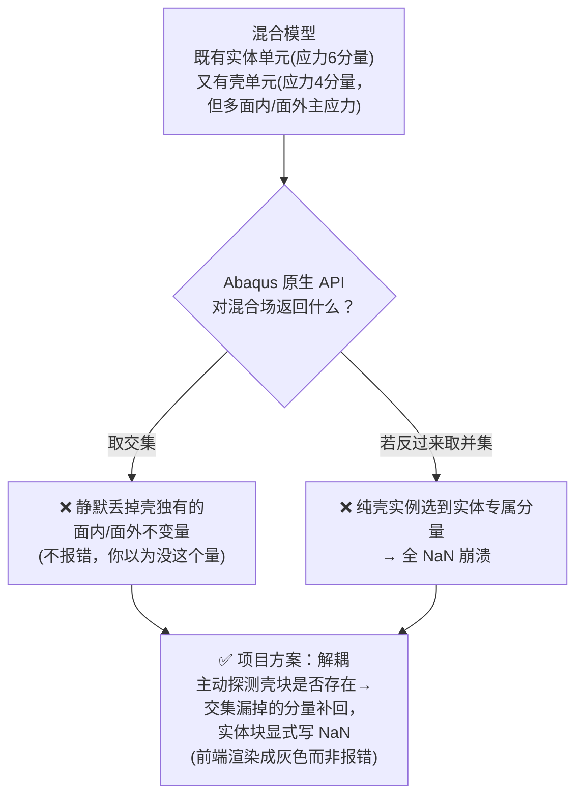

**沉淀出的通用原则**：凡是合并壳和实体的元数据，必须想清楚用并集还是交集——**并集要给缺数据置灰，交集要显式把缺的补回来**。所有公式集中在 `src/l1/abaqus_dump.py::_compute_invariants_numpy`，配 `docs/l1/不变量计算公式表.md` 做公式台账逐条记录修正历史，并有回归测试固化。

### 3.2 大规模数据渲染：内存 / 传输 / 空间索引三件套

难点与解法在 2.2 / 2.3 已展开，这里点出三个"从设计文档到实现"的关键取舍：

| 维度 | 最初设计 | 实际实现 | 为什么改 |
|---|---|---|---|
| 几何格式 | Triangle Soup（全展开无索引） | **索引几何**（单元面内共享顶点） | 内存降到 1/3~1/2，硬边效果照样保留 |
| 内存 | — | **fork + CoW 共享**（不用 dict 用 searchsorted 数组） | 4 worker 内存 ≈ 1 worker |
| 传输 | — | **L3BE 二进制协议** + GZip | 避开 JSON 的 33% 膨胀与序列化开销 |

> 注：`ODB-Service-Architecture.md` 里写的是 Triangle Soup，现已演进为索引几何（`docs/技术文档.md` 5.3.4 已反映现状）。`render_face_idx` 在新实现里含义变为"三角形序号"，但作为拾取/八叉树/前端高亮的稳定锚点，功能定位不变。

### 3.3 表面提取与高阶单元线性化

难点与向量化解法见 2.2。这里单独讲**高阶单元中节点的精度坑**，因为它和 3.1 是同源问题：

- 高阶单元（如 C3D20）建渲染面时，最初**只用角节点、丢弃边中节点**，导致边中节点上的应力峰值从未进入渲染，**云图峰值系统性比 Abaqus 偏低 3~4%**（实测 S13 分量 8032 vs Abaqus 8324）。
- 排查发现：原始积分点数据完全正确，问题纯粹出在"建面和取值都只走角节点"。
- 解法（方案 A2）：二次三角面（6 节点）细分成 4 个子三角、二次四边面（8 节点）细分成 6 个子三角，把中节点也纳入渲染插值。更精确的方案 A1（合成面心点 + Q8 二次插值）已在文档列为待办。

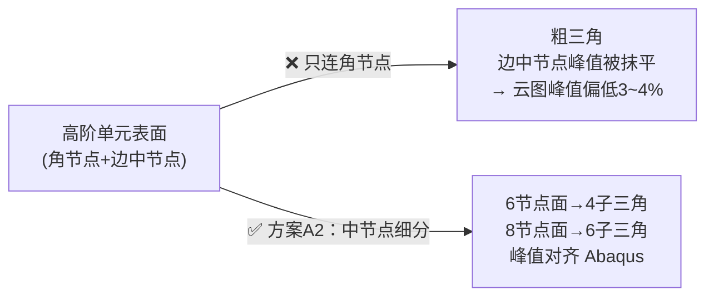

### 3.4 自研 Abaqus INP 解析器

**为什么不用现成库**：pyNastran 只认 Nastran BDF，市面上没有输出能跟 ODB 提取结果严格对齐的开源 INP 解析库；而模型修正要在**不启动 Abaqus license** 的情况下解析/改写 INP。INP 文本格式陷阱不少：关键字大小写不敏感、行尾逗号续行、`*INCLUDE` 可递归嵌套要防死循环、同名 Set 多次定义取并集、`*Coupling` 这类约束**根本不是单元**、要靠 `*Kinematic/*Distributing` 子块才能定性再"凭空"展开成几何线段。

解法是四层职责严格分离的流水线：

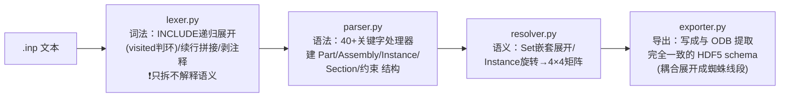
核心设计原则是 **"Data Fidelity"**：INP 解析产出必须与 `abaqus_dump.py` 的 ODB 提取产物在 HDF5 schema 上完全一致，L2/L3 才能对两种数据源无感知复用同一套管道。出错不直接抛异常炸掉，而是收集成诊断信息定位到具体文件行。

### 3.5 跨数据源一致性与特殊单元

三条路径（ODB / INP / BDF）命名习惯完全不同，两个典型坑：

- **大小写**：Abaqus 生成 ODB 时把所有集合名"烙成"大写且不可逆，INP 保留用户原始大小写，字面比较就对不上（`_PickedSet6` vs `_PICKEDSET6`）。解法是**在名字第一次进入流水线的源头归一化**（INP 侧写库前 `.upper()`，instance 名走 `canon_instance()`），而不是在每个比较点打补丁。
- **特殊单元 spider 耦合**：耦合/连接器/质量/弹簧这类没有曲面几何的单元，最初因不在白名单被静默丢弃、前端看不见。更妙的是**同一个耦合约束有两种"变身"**——Abaqus 到了 ODB 里被求解器实体化成看不见名字的 `DCOUP3D` 单元，INP 侧却是 `*Coupling` 约束关键字，两条完全不同的起点最终要拼出同一份 `couplings/positions` 数据：

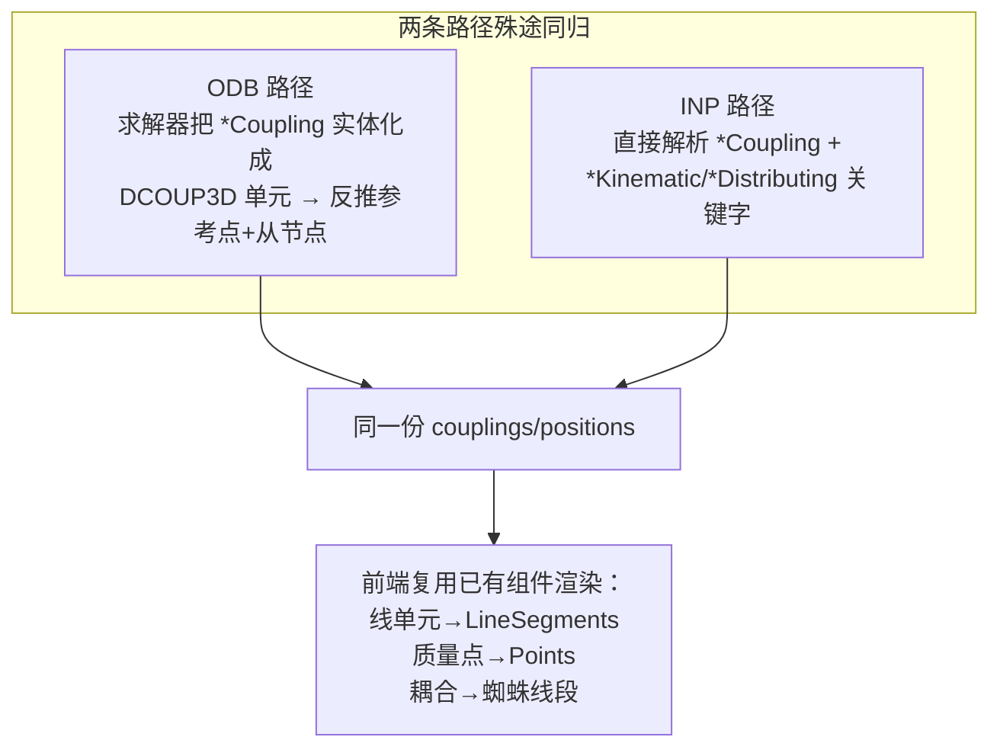
> 附带案例 —— **section_assignment 图例演进**：真实优化型 BDF 可能有 1000+ 个仅厚度不同的 PSHELL，按属性号逐个生成图例会炸出 1000+ 条。经过 4 次迭代打磨，改为**按"截面类型+厚度"归并**，某模型从 1548 个属性塌缩到 **11 条**可读图例（标签 `SHELL_{代表PID} (h=..)`），既可读又可追溯回原始 BDF。

---

## 四、主线二 · 模型修正闭环（试验 → 匹配 → 灵敏度 → 贝叶斯 → 写回）

### 4.1 这条主线在做什么

前面的可视化解决"看结果"，这条主线解决"**结果不准怎么办**"：用真实物理试验测出的数据（模态频率、振型、静力位移），反过来自动校准仿真模型的参数（材料弹性模量、壳厚等），让仿真越来越接近现实。本质是一个**闭环迭代**：

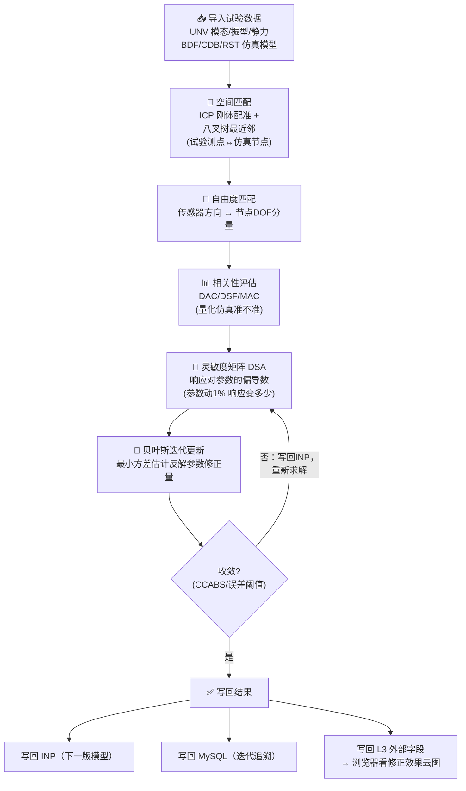

### 4.2 三个技术要点

**① 试验-仿真配准（点云匹配）**：试验传感器坐标系和仿真节点坐标系往往不重合、还有安装误差。用 **ICP（迭代最近点）** 自动做刚体配准（支持"仅平移"和"平移+旋转"两种模式），再用八叉树最近邻把每个测点落到最近的仿真节点，超容差的允许被剔除而不是强行匹配错。

**② 灵敏度矩阵不是"试出来"的**：不用有限差分（改一次参数重算一次），而是生成 Abaqus DSA / Nastran SOL200 专用输入文件，调用求解器自身的**解析灵敏度**能力，精度更高。关键的三级映射链路（也是最容易让人困惑的地方）：

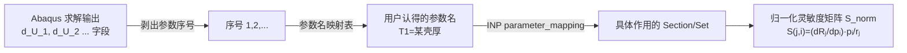
**为什么要归一化**：原始灵敏度里，弹性模量（量级 1e11）和壳厚（1e-3）、位移（1e-3）和应力（1e8）数量级天差地别，直接做反演会被大数量级的量支配。无量纲化成"相对变化"后，所有参数和响应在同一尺度，反演才稳定。

**③ 贝叶斯参数估计（注意：不是机器学习里的"贝叶斯优化"）**：用参数先验协方差 + 响应观测协方差构造增益矩阵（本质是最小方差估计 / 类卡尔曼滤波），加 Tikhonov 阻尼防止矩阵病态，参数更新后夹到物理上下界。这是 FEMTools 等模型修正商业软件采用的标准算法——之所以不用遗传算法/粒子群，是因为**有 DSA 精确梯度时，基于增益矩阵的迭代通常十几次就收敛，而无梯度方法要几百上千次**。

### 4.3 多求解器统一 & 程序组织

主线二一开始围绕 Abaqus 设计，后扩展支持 Nastran（BDF/OP2）和 Ansys（CDB/RST）。做法是**"归一化 model dict + 统一落库函数"**：无论数据来自哪个求解器，材料/壳厚等元数据落到同一批 MySQL 表，下游灵敏度/贝叶斯层完全不用区分来源。

```
services/model_update/
├── analysis/        — 业务编排（最核心）
│   ├── fem_matching_service.py   — ICP 配准 + 八叉树最近邻 + DOF 匹配
│   ├── fem_correlation_service.py— DAC/DSF/MAC 相关性
│   ├── sensitivity_service.py    — 灵敏度工作台（5775行）
│   ├── bayesian_service.py       — 贝叶斯迭代主逻辑（5673行）
│   └── solver_service.py         — Abaqus/Nastran 求解器调度
├── importers/       — bdf/unv/op2/cdb/rst 各格式导入 → 统一落库
└── solver_prep/     — 生成 DSA/adjoint/SOL103/SOL200 求解输入文件
webapi/routers/      — REST 接口（fem/test_data/matching/sensitivity/optimization/solver）
src/inp/             — 自研 INP 解析器（主线一、二共用）
```
> 所有耗时操作（灵敏度、贝叶斯、求解）都走"提交任务 → 轮询状态"的异步模式，前端拿 `task_id` 轮询，避免长请求超时。

---

## 五、程序组织结构

一张图看清整个仓库的模块分层与依赖方向：

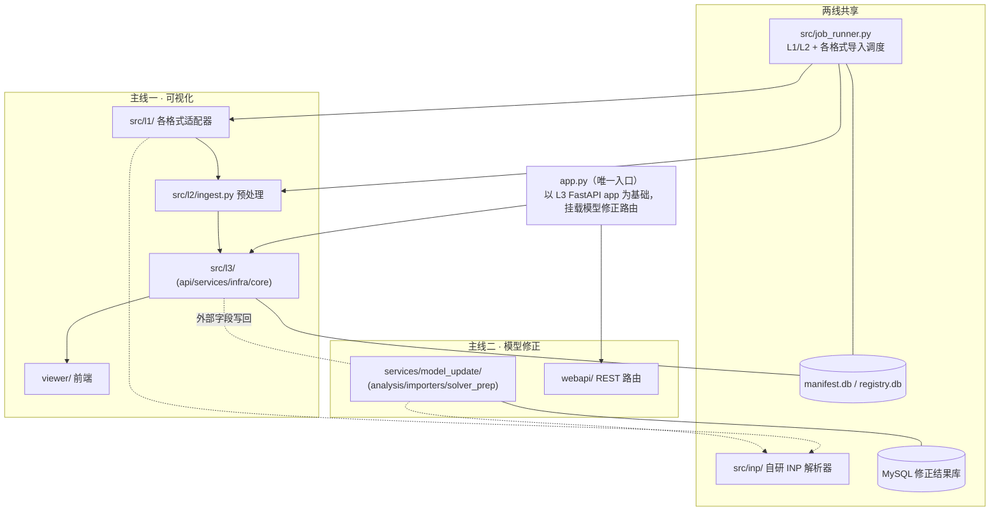

| 层/模块 | 目录 | 职责 |
|---|---|---|
| 入口 | `app.py` | 合并两条主线的 FastAPI 路由，端口默认 5000 |
| L1 提取 | `src/l1/` | 各格式 → 统一 HDF5 + manifest.db |
| L2 预处理 | `src/l2/ingest.py` | 表面/三角化/特征边/八叉树/均化域 |
| L3 服务 | `src/l3/` | Router / Service / Repo 三层，HTTP + L3BE |
| 前端 | `viewer/` | Vue3 + Three.js |
| 模型修正 | `services/model_update/`、`webapi/` | 匹配/灵敏度/贝叶斯 + REST |
| INP 解析器 | `src/inp/` | 两线共用，纯 Python 解析 Abaqus INP |
| 后台调度 | `src/job_runner.py` | 独立进程，认领并执行 L1/L2/导入任务 |

---

## 六、最终达成的效果

### 6.1 能力总览

平台已实现从**四种格式原始文件**到**浏览器三维交互后处理**的完整贯通，并叠加了模型修正闭环。核心指标：

| 维度 | 达成效果 |
|---|---|
| **格式支持** | Abaqus INP/ODB、Nastran BDF/OP2（含/不含嵌入几何）；Ansys CDB/RST（修正主线）；自动识别 + 一致性校验 |
| **模型规模** | ≤ 1000 万节点、数十个装配实例、数十个分析步、数百帧 |
| **免许可证** | INP/BDF/OP2 全链路免 license，ODB 仅提取阶段需要 |
| **免客户端** | 任意现代浏览器直接访问，无需安装插件 |
| **拾取响应** | < 100 ms（千万三角面，BVH 加速） |
| **振型动画** | 60 fps（GPU 着色器，与规模无关） |
| **云图切换** | < 500 ms（百万节点，只传颜色属性） |
| **并发内存** | 4 worker 共享 ≈ 2 GB（CoW） |
| **数值精度** | 不变量公式逐位对齐 Abaqus，混合 solid-shell、高阶单元峰值均已对齐 |

### 6.2 功能清单

三维旋转/平移/缩放 · 透视/正交切换 · 结果云图（平滑/平面着色）· 自定义图例区间 · 变形显示（nlgeom 自动锁定）· 单元/节点精确拾取（返回 ODB 原始标签与结果值）· 包围框区域选择 · 多点探针表格 · 截面切割（X/Y/Z，含填充与着色）· 模态振型动画（GPU/CPU 双模式）· 特征边线框 · 梁杆线单元 / 质量点 / 耦合蜘蛛线渲染 · 结果分量选择 · 多工况结果组切换 · 用户自定义集合 · 模型修正闭环（ICP 配准 / DAC-DSF-MAC 相关性 / DSA 灵敏度 / 贝叶斯迭代 / 修正效果云图回写）。

### 6.3 工程方法论沉淀

除了功能本身，项目最有价值的沉淀是一套**"逐位对齐 + 对照脚本 + 回归测试"的工程方法论**：对每一个"不报错但会悄悄错"的数值口径问题（不变量公式、混合模型交并集、高阶单元峰值、Nastran 坐标系），都通过写独立对照脚本逐值比对 Abaqus/FEMTools、定位后修复、再用回归测试固化，避免同一个坑踩第二次。这是比任何单一功能都更能体现团队真功夫的地方。

---

## 七、附录 · 文档地图

| 文档 | 用途 |
|---|---|
| `docs/技术文档.md` | **逐模块详尽工程说明书**（本文的详细版底座） |
| `ODB-Service-Architecture.md` | 最初整体设计文档（理解设计初衷；冲突处以代码为准） |
| `docs/l3/L3-API-Quick-Reference.md` | **当前权威接口文档**（前端/调用方对接） |
| `docs/l3/Binary-Payload-Spec.md` | L3BE 二进制协议规范 |
| `docs/l1/不变量计算公式表.md` | 应力不变量公式台账（数值对齐历史） |
| `docs/混合solid-shell模型陷阱与排查.md` | 交集/并集陷阱方法论 |
| `docs/l2/HighOrder-Midside-Subdivision-Design.md` | 高阶单元中节点细分设计 |
| `docs/Special-Element-Handling.md` | 特殊单元（耦合/连接器/质量/弹簧）处理约定 |
| `docs/model_update/` | 模型修正主线全部设计文档（灵敏度/贝叶斯/Nastran 扩展） |
| `FEM-Viewer-Primer.md` | FEM 概念、ODB 结构与 Three.js 渲染关系科普 |

---

*本文由项目技术架构梳理汇总而成，图示均为原理示意。需要精确接口签名、部署命令、数据库表结构时，请以上表所列对应权威文档与代码为准。*
